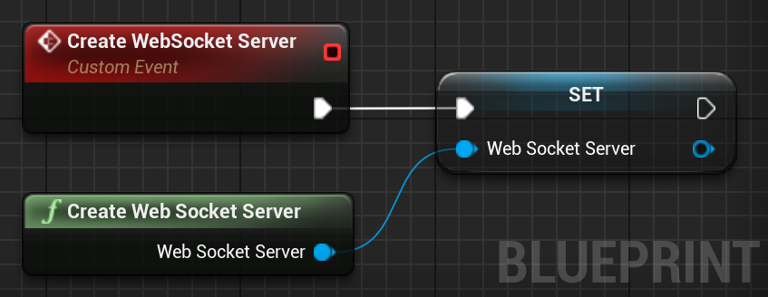
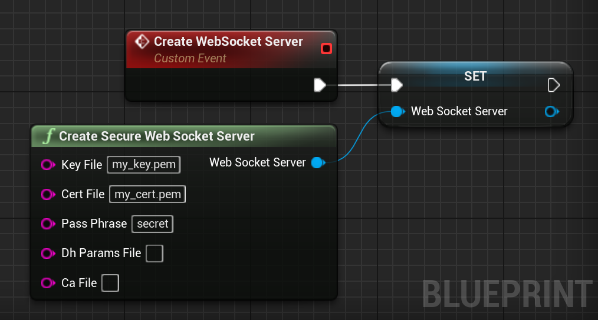
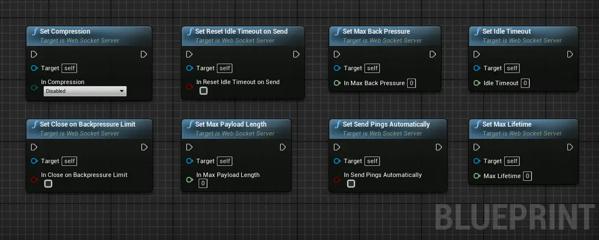
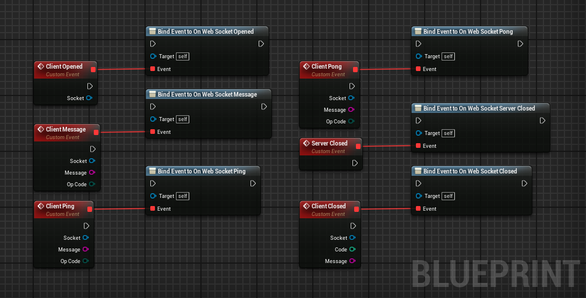
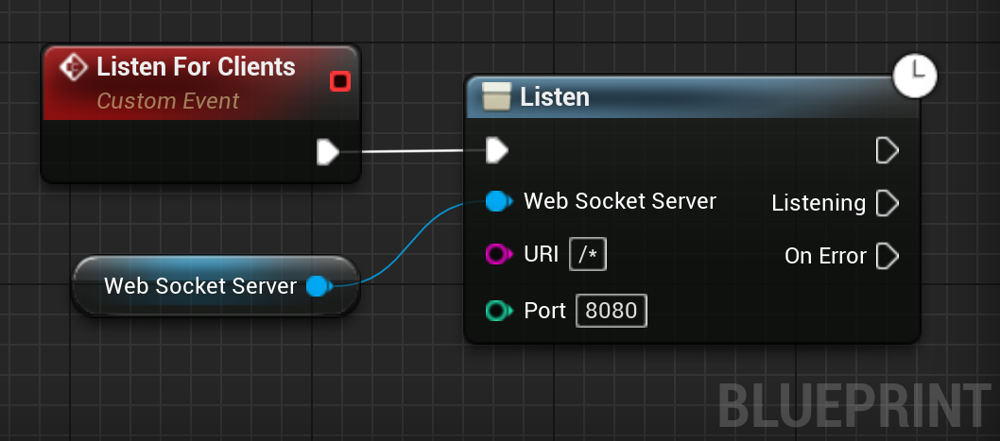
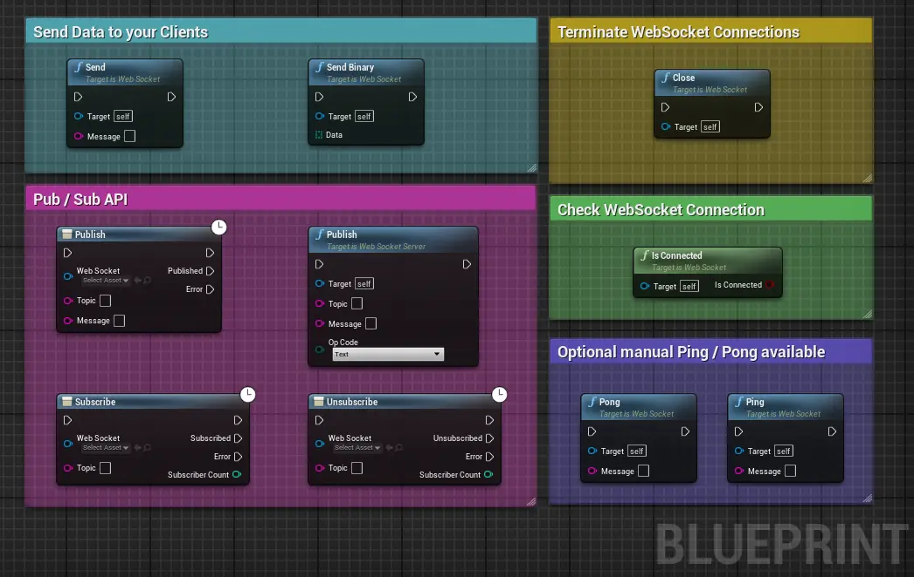
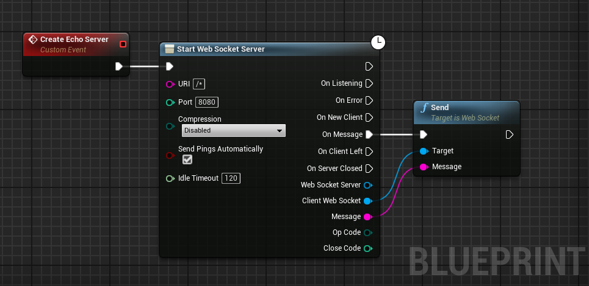
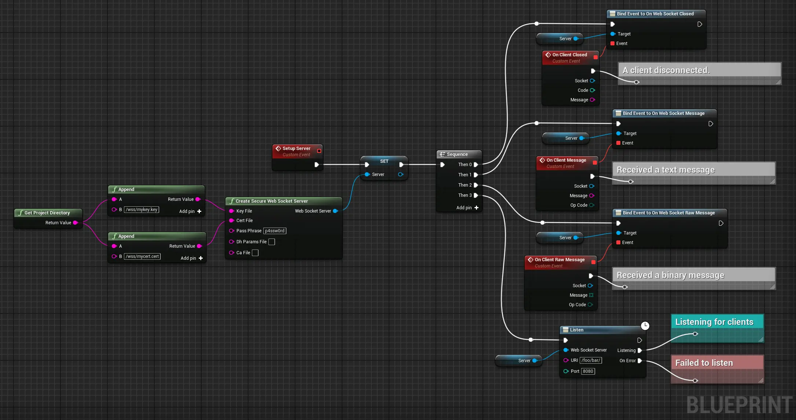
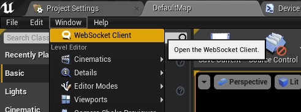

# Blueprints
This section shows how to use the plugin to create a WebSocket server in Unreal Engine using Blueprints and listen for client WebSockets.

## Creating a WebSocket Server
To create a WebSocket Server, call the `CreateWebSocketServer` node.  
Make sure to store the result in a variable to prevent it from 
being garbage collected.   

## Creating a Secure WebSocket Server
To create an WebSocket Server with WSS, call the `Create Secure WebSocket Server` node.  
This node takes 5 parameters:
1. **Key File**: The location of the private key for our WSS Server on disk.
2. **Cert File**: The location of the certificate for our WSS server on disk.
3. **Dh Params File**: An optional DH parameters file.
4. **CA File**: An optional CA file.  

## Configuring the Server.
Now that the server is created, you can configure your server. The following nodes are available:

## Handling Events
A WebSocket Server offers several events to interact with clients. 

The following image shows the events you can bind.

!> You must bind the events before calling the `Listen` node.

## Listening for Clients
Once the events are correctly setup, it's time to start listening for WebSocket client connections.

The `Listen` node takes two parameters:
1. **URI**: The location where to reach the WebSocket Server. It supports dynamic routes (i.e. `/path/:id/*` for `/path/{number}/*`).
2. **Port**: The port were the server will be available.

!> Make sure to start your URI by a forward slash (`/`)

## Interracting with your Clients
Now that the server listens and accepts new connections, you can communicate with your clients.
To do so, the following nodes are available:

## Echo Server Example
The following example shows how to create a simple echo server. It uses an helper node that creates, binds and configures
the server under the hood.

## Advanced Server Example

## Client for Testing
If you want to test your server with a client, you can use the client included in the plugin.
To open it, go to `Windows` > `WebSocket Client`.

